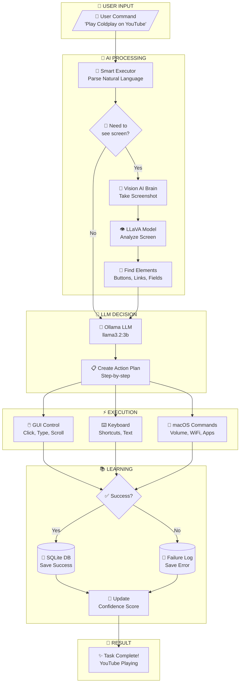
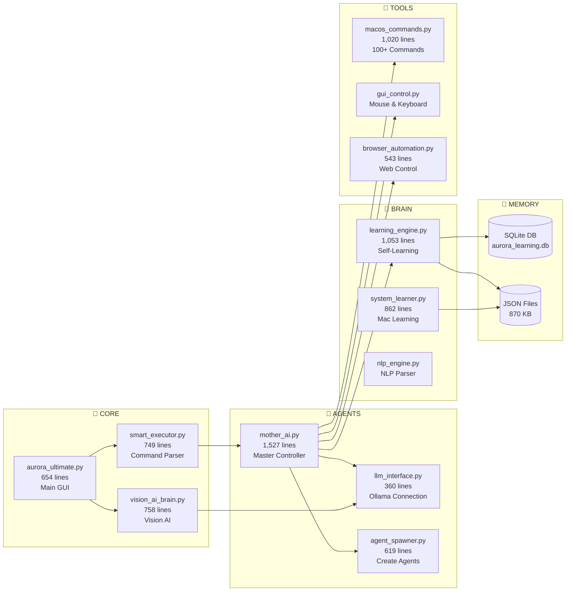
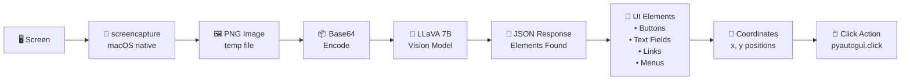
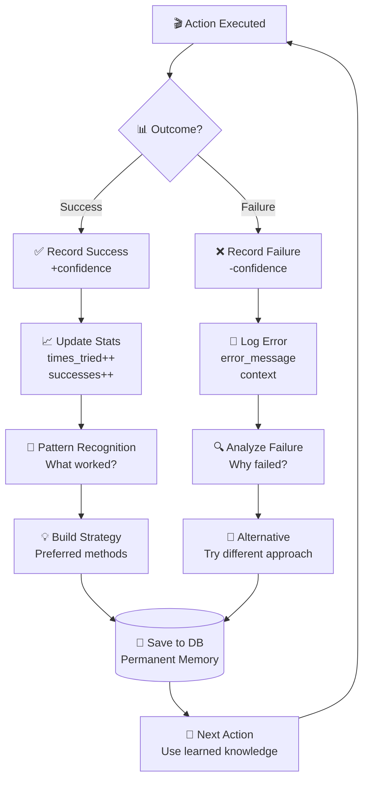
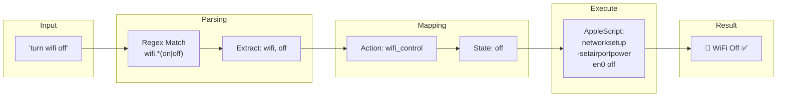

# 🌟 AURORA AI - System Flowchart

> **macOS Automation System with Vision AI & Self-Learning**

---

## 📊 Project Stats

| Metric | Value |
|--------|-------|
| **Lines of Code** | 12,592 |
| **Python Files** | 36 |
| **Learning Data** | 870 KB |
| **Mac Commands** | 100+ |

---

## 📍 Main System Flow



---

## 🏗️ Component Architecture



---

## 👁️ Vision AI Processing Flow



---

## 🔄 Self-Learning Cycle



---

## 💬 Natural Language Command Processing



---

## 📁 File Structure

```
ai-world/
├── 🎯 CORE
│   ├── aurora_ultimate.py      # Main GUI (654 lines)
│   ├── vision_ai_brain.py      # Vision AI (758 lines)
│   ├── smart_executor.py       # Command Parser (749 lines)
│   ├── action_tracker.py       # Track Actions
│   └── autonomous_explorer.py  # Auto-Pilot Mode
│
├── 🤖 agents/
│   ├── mother_ai.py            # Master AI (1,527 lines)
│   ├── llm_interface.py        # Ollama (360 lines)
│   ├── agent_spawner.py        # Spawn Agents (619 lines)
│   └── event_bus.py            # Agent Communication
│
├── 🧠 brain/
│   ├── learning_engine.py      # Self-Learning (1,053 lines)
│   ├── system_learner.py       # Mac Learning (862 lines)
│   ├── nlp_engine.py           # NLP Parser
│   ├── memory_system.py        # Memory Storage
│   ├── state_tracker.py        # Current State
│   ├── goal_generator.py       # Goal Planning
│   ├── priority_system.py      # Task Priorities
│   └── resource_tracker.py     # CPU/RAM Monitor
│
├── 🔧 tools/
│   ├── macos_commands.py       # 100+ Commands (1,020 lines)
│   ├── actions/
│   │   ├── gui_control.py      # Mouse & Keyboard
│   │   ├── browser_automation.py # Web Control (543 lines)
│   │   ├── file_ops.py         # File Operations
│   │   ├── web_tools.py        # HTTP Requests
│   │   └── code_executor.py    # Run Code
│   └── sensors/
│       ├── vision.py           # Screen Capture
│       ├── system_monitor.py   # System Stats
│       ├── voice_system.py     # Speak & Listen
│       └── audio.py            # Audio Output
│
├── ⚙️ config/
│   ├── settings.py             # All Settings
│   └── founder_protection.py   # Owner Security
│
└── 💾 aurora_memory/           # Persistent Memory (870 KB)
    ├── learned_actions.json    # What works (90 KB)
    ├── action_history.json     # All actions (172 KB)
    ├── behavior_patterns.json  # Patterns (176 KB)
    ├── experiences_log.json    # Experiences (218 KB)
    ├── failure_log.json        # Failures (9 KB)
    └── acquired_skills.json    # Skills learned
```

---

## 🎯 How It Works (Simple)

```
┌─────────────────────────────────────────────────────────────┐
│  YOU: "Play Coldplay on YouTube"                            │
└─────────────────────────────────────────────────────────────┘
                            │
                            ▼
┌─────────────────────────────────────────────────────────────┐
│  SMART EXECUTOR: Parse command                              │
│  → Action: youtube_play                                     │
│  → Query: "Coldplay"                                        │
└─────────────────────────────────────────────────────────────┘
                            │
                            ▼
┌─────────────────────────────────────────────────────────────┐
│  VISION AI: Take screenshot → Send to LLaVA                 │
│  → Found: Search bar at (500, 100)                          │
│  → Found: Play button at (600, 300)                         │
└─────────────────────────────────────────────────────────────┘
                            │
                            ▼
┌─────────────────────────────────────────────────────────────┐
│  LLM BRAIN: Create action plan                              │
│  1. Open browser                                            │
│  2. Go to youtube.com                                       │
│  3. Click search bar                                        │
│  4. Type "Coldplay"                                         │
│  5. Press Enter                                             │
│  6. Click first video                                       │
└─────────────────────────────────────────────────────────────┘
                            │
                            ▼
┌─────────────────────────────────────────────────────────────┐
│  EXECUTOR: Run each step                                    │
│  → pyautogui.click(500, 100)                                │
│  → pyautogui.write("Coldplay")                              │
│  → pyautogui.press("enter")                                 │
└─────────────────────────────────────────────────────────────┘
                            │
                            ▼
┌─────────────────────────────────────────────────────────────┐
│  LEARNING: Record outcome                                   │
│  ✅ Success! Save to database                               │
│  → Next time: faster, more confident                        │
└─────────────────────────────────────────────────────────────┘
                            │
                            ▼
┌─────────────────────────────────────────────────────────────┐
│  🎵 YouTube plays Coldplay!                                 │
└─────────────────────────────────────────────────────────────┘
```

---

## 🔑 Legend

| Symbol | Meaning |
|--------|---------|
| 🎯 | Core files |
| 🤖 | Agent system |
| 🧠 | Brain/Intelligence |
| 🔧 | Tools/Actions |
| 💾 | Memory/Storage |
| 👁️ | Vision system |
| ⚡ | Execution |
| 📚 | Learning |

---

*Project: Aurora AI*  
*Created by: Karthik*  
*Lines of Code: 12,592*  
*Last Updated: December 2025*
